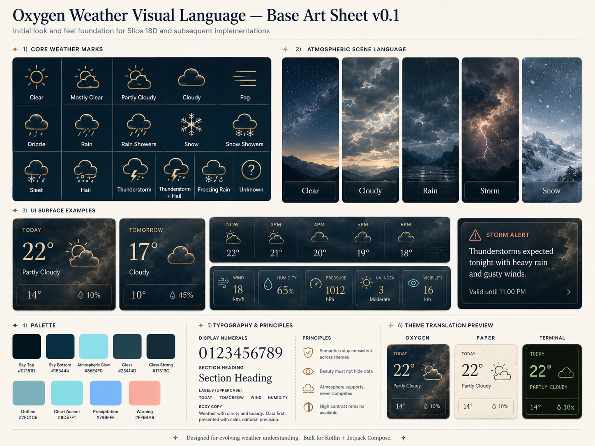

# Oxygen Weather for Android — Full Product and Technical Specification

**Specification version:** 0.2.0  
**Status:** Scaffold implementation authority  
**Platform:** Android  
**Primary implementation:** Kotlin + Jetpack Compose  
**Product model:** Free, open source, no advertising, no account required  
**Project principle:** *Beautiful by default, exceptionally configurable when desired, and completely understandable when stripped of every decorative effect.*

---

## 1. Product Definition

Oxygen is a privacy-respecting Android weather application intended to provide the useful capabilities found in mainstream commercial weather applications without advertising, behavioral tracking, subscriptions, mandatory accounts, or dependence on a single proprietary weather vendor.

Oxygen should feel unusually beautiful by default. The default experience must be carefully composed enough that a user never needs to customize it. At the same time, presentation should be deeply configurable for users who want a radically different visual treatment, information density, icon family, or weather-scene behavior.

The application must remain understandable and fully useful when all decorative effects are disabled.

### 1.1 Core principles

1. No ads.
2. No advertising SDKs.
3. No behavioral tracking.
4. No mandatory analytics.
5. No login or cloud account.
6. Location permission is optional.
7. Manually selected locations provide full weather functionality.
8. Weather providers are replaceable.
9. Cached forecasts remain usable offline.
10. Data provenance and attribution are visible.
11. Observations, model estimates, forecasts, derived values, and official alerts remain semantically distinct.
12. Safety information is never presented as more timely or authoritative than its source supports.
13. Themes control presentation; Oxygen controls semantics.
14. Accessibility cannot be disabled by a theme.
15. Free data and free infrastructure are treated as separate engineering concerns.

---

## 2. Experience Goal

The primary experience target is:

> The weather is the artwork. The data is the interface.

Oxygen should use actual weather state to influence the environment of the application without making weather information dependent on decoration.

A rainy morning should feel different from a clear winter night before the user consciously reads the text. That atmospheric response should come from procedural rendering and semantic visual state rather than downloaded photographs.

### 2.1 Initial visual language authority

The initial look-and-feel foundation is captured in:

```text
docs/assets/oxygen-weather-visual-language-base-art-sheet-v0.1.png
```



This art sheet is a product-design authority for Slice 18D and subsequent Home
visual implementation slices. It establishes the initial direction for:

- core provider-neutral weather marks;
- atmospheric scene language for clear, cloudy, rain, storm, and snow states;
- glass-like weather surfaces with strong readable numerals;
- compact forecast, metric, and alert surface examples;
- initial palette names and color references;
- typography direction for display numerals, section headings, labels, and body copy;
- theme translation direction across Oxygen, Paper, and Terminal.

The art sheet does not authorize production bitmap weather icons, downloaded
photographic weather backgrounds, inaccessible contrast, hidden weather text,
fabricated weather values, provider-specific UI leakage, or a premature theme
engine. Weather meaning still comes from provider-neutral domain and presentation
state. Programmatic graphics such as daily range bars, charts, weather marks, and
scene effects should be rendered by Compose/vector/procedural code unless a later
asset-specific slice explicitly specifies otherwise.

The application should remain useful with:

- animation disabled;
- gradients disabled;
- atmospheric scenes disabled;
- transparency disabled;
- device offline;
- location permission denied;
- large accessibility text enabled;
- high-contrast or monochrome presentation selected.

---

## 3. Release Scope

### 3.1 MVP / 1.0

- Current location or manually selected location.
- Multiple saved locations.
- Current conditions.
- 24–48 hour hourly forecast.
- 7–10 day daily forecast.
- Temperature.
- Apparent temperature.
- Precipitation probability and amount.
- Rain/snow distinction where available.
- Humidity.
- Dew point.
- Wind speed, direction, and gusts.
- Atmospheric pressure.
- Cloud cover.
- Visibility.
- UV index where available.
- Sunrise and sunset.
- Official severe-weather alerts for supported regions.
- Offline display of most recently downloaded forecast.
- Source and update information.
- Metric, US, UK, and custom unit preferences.
- Light/dark/theme presentation.
- Accessibility support.
- Theme engine.
- Layout density presets.
- Weather effects Off/Subtle/Full.
- No advertising, telemetry, account, or cloud dependency.

### 3.2 1.x

- Air quality.
- Pollen where data supports it.
- Regional weather radar.
- Detailed charts.
- Android home-screen widgets.
- Optional daily summary notifications.
- Best-effort alert polling.
- Moonrise, moonset, and lunar phase.
- Forecast sharing.
- Favorite/reordered locations.
- Additional national weather sources.
- Home module customization.
- Additional built-in themes and icon packs.

### 3.3 Later

- Historical weather.
- Forecast versus observed comparison.
- Model comparison.
- Ensemble forecasts and uncertainty.
- Marine forecasts.
- Flood information.
- Snow depth.
- Soil variables.
- Fire-weather information.
- Lightning layers.
- Satellite imagery where open sources exist.
- User-configurable provider endpoints.
- Self-hostable Oxygen relay.
- WMO WIS2 ingestion.
- Community theme packaging.

---

## 4. Infrastructure Reality

Weather data can often be obtained under open or public terms. A global weather service with guaranteed capacity, radar, alerts, and map delivery is not guaranteed to remain cost-free.

The principal infrastructure constraints are:

- public API capacity and rate limits;
- radar distribution;
- worldwide official alert aggregation;
- map tile hosting;
- push delivery for urgent alert notifications;
- provider policy changes.

Oxygen therefore must not make a single hosted API structurally indispensable.

```text
Oxygen UI
    |
WeatherRepository
    |
Provider interfaces
    |
+------------------+------------------+------------------+
| ForecastProvider | AlertProvider    | RadarProvider    |
+------------------+------------------+------------------+
        |                   |                  |
    Open-Meteo             NWS             NOAA OGC
    MET Norway             ECCC            DWD
    future source          WIS2            future source
```

Provider URLs must be configuration, not scattered literals.

---

## 5. Recommended Data Sources

| Function | Initial source | Coverage | Authentication | Oxygen role |
|---|---|---:|---|---|
| General forecast | Open-Meteo | Global | None for public endpoint | Primary MVP |
| Forecast fallback | MET Norway Locationforecast | Global | Identifying User-Agent | Fallback |
| US official alerts | NOAA/NWS | United States | Identifying User-Agent | MVP |
| US observations | NOAA/NWS | United States | Identifying User-Agent | 1.x |
| US radar | NOAA/NWS RIDGE2 / OGC | United States | Public service | 1.x |
| Canadian alerts | Environment and Climate Change Canada CAP | Canada | Public open-data service | 1.x |
| European alerts | MeteoAlarm / permitted gateway | Europe | Source-dependent | 1.x/2.x |
| German model/radar | DWD Open Data | Germany/global model products | Public | Optional |
| Air quality | Open-Meteo/CAMS | Broad/global depending variable | Public endpoint | 1.x |
| Geocoding | Open-Meteo/GeoNames or replaceable geocoder | Global | Provider-dependent | MVP |
| Map rendering | MapLibre Native | N/A | None | 1.x |
| Global official aggregation | WMO WIS2 | Global | Protocol/source-dependent | Long term |

Every provider integration must have its own Markdown contract under `docs/data-sources/` before release.

---

## 6. Forecast Provider Strategy

### 6.1 Open-Meteo

Open-Meteo is the recommended initial general forecast provider because it exposes a broad set of forecast variables and normalizes multiple numerical-weather models behind a common API.

The Oxygen client should request a coherent set of current, hourly, and daily fields in as few network requests as practical.

Required categories include:

- temperature;
- apparent temperature;
- relative humidity;
- dew point;
- precipitation probability;
- precipitation amount;
- rain/showers/snowfall where available;
- weather code;
- cloud cover;
- pressure;
- visibility;
- wind speed/direction/gusts;
- UV index;
- sunrise/sunset;
- daylight duration.

Current conditions returned from forecast/model products must be represented as model estimates unless the provider explicitly identifies an observation.

### 6.2 MET Norway

Use MET Norway as an alternate forecast provider. Respect provider identification, caching requirements, and attribution. Do not silently average or merge its forecast values with another provider.

### 6.3 Provider selection rule

```text
Forecast:
    selected forecast provider
    default = Open-Meteo
    fallback = MET Norway

Official alerts:
    selected geographically from authoritative sources

Observations:
    official station source when implemented
    otherwise clearly labeled model-estimated current conditions

Radar:
    regional open provider or unavailable
```

Forecast preference must not accidentally disable official safety alerts.

---

## 7. Alert Strategy

Forecasts and alerts are separate systems.

```kotlin
interface AlertProvider {
    val id: String
    suspend fun getActiveAlerts(location: GeoPoint): List<WeatherAlert>
}
```

Initial geographic routing:

```text
United States -> NOAA/NWS
Canada        -> ECCC CAP
Europe        -> MeteoAlarm where permitted
Other         -> supported WIS2/national source or unsupported
```

Do not infer an official alert from forecast conditions. A modeled thunderstorm risk is not a tornado warning.

Alert records must retain:

- issuer;
- event type;
- severity;
- urgency/certainty when available;
- effective time;
- expiration time;
- description;
- instructions;
- affected geometry where available;
- provenance.

---

## 8. Radar Strategy

Radar is regional capability, not a guaranteed global feature.

Initial targets:

- United States: NOAA/NWS OGC/RIDGE2 products.
- Germany/central Europe research: DWD open radar products.

If open radar is not available for a region, Oxygen should say so plainly.

Never label a forecast precipitation layer as "Radar".

The map/radar layer must be isolated behind `RadarProvider` so sources can be replaced without redesigning the screen.

---

## 9. Air Quality

Air-quality data should preserve both raw pollutant values and any computed/index value.

```kotlin
data class AirQuality(
    val timestamp: Instant,
    val aqi: Int?,
    val standardName: String?,
    val pm25: Double?,
    val pm10: Double?,
    val ozone: Double?,
    val nitrogenDioxide: Double?,
    val provenance: DataProvenance,
)
```

AQI standards differ by jurisdiction. The UI must identify the standard rather than displaying a context-free number.

---

## 10. Geocoding

Geocoding must be replaceable.

Requirements:

- search by city/place name;
- latitude/longitude;
- timezone;
- country;
- administrative area;
- optional elevation;
- stable local `LocationId` independent of provider identity.

Avoid hard-wiring the application to a public OSM Nominatim server as the only autocomplete backend. Public infrastructure policies can make that unsuitable for a popular mobile client.

---

## 11. Map Architecture

Use MapLibre Native when map functionality is introduced.

MapLibre is a renderer, not a tile-hosting strategy. Map tiles must come from a source whose terms and capacity support Oxygen.

Production options include:

- self-hosted vector tiles;
- PMTiles;
- permitted third-party/community tile service;
- configurable user endpoint.

Do not assume OpenStreetMap's community tile servers are an unlimited production CDN.

---

## 12. Canonical Data Model

Provider JSON must never reach a Composable.

```text
provider DTO
    -> validation
    -> provider mapper
    -> Oxygen domain model
    -> repository/cache
    -> presentation state
    -> Compose
```

### 12.1 Provenance

Every significant block must be able to identify its source.

```kotlin
data class DataProvenance(
    val providerId: String,
    val sourceName: String,
    val issuedAt: Instant?,
    val fetchedAt: Instant,
    val type: DataType,
    val licenseId: String?,
)

enum class DataType {
    OBSERVATION,
    MODEL_ESTIMATE,
    FORECAST,
    OFFICIAL_ALERT,
    DERIVED,
}
```

This distinction is a product feature, not metadata trivia.

---

## 13. Weather Condition Taxonomy

Oxygen maintains a provider-neutral semantic vocabulary:

```text
CLEAR
MOSTLY_CLEAR
PARTLY_CLOUDY
CLOUDY
FOG
DRIZZLE
FREEZING_DRIZZLE
RAIN
FREEZING_RAIN
RAIN_SHOWERS
SNOW
SNOW_SHOWERS
SLEET
HAIL
THUNDERSTORM
THUNDERSTORM_HAIL
UNKNOWN
```

Each provider gets an explicit mapping with unit tests.

Provider-specific numeric codes must not leak into feature/UI code.

---

## 14. Android Architecture

Use a layered, unidirectional architecture:

```text
Compose UI
    |
ViewModel / screen state holder
    |
Use cases where logic justifies them
    |
Repositories
    |
Local and remote data sources
```

The scaffold begins with `:app` and `:core` because the source project already proves that configuration. Split further only as code volume justifies it.

Long-term module target:

```text
:app

:core:model
:core:network
:core:database
:core:designsystem
:core:theme
:core:weathergraphics
:core:charts
:core:location
:core:preferences
:core:testing

:data:weather
:data:alerts
:data:airquality
:data:geocoding
:data:radar

:feature:home
:feature:forecast
:feature:alerts
:feature:map
:feature:locations
:feature:settings
:feature:about
```

Do not prematurely create dozens of Gradle modules while the application is small.

---

## 15. Baseline Android Stack

- Kotlin.
- Jetpack Compose.
- Material 3 as component foundation.
- Coroutines and Flow.
- ViewModel.
- Room.
- DataStore.
- WorkManager.
- OkHttp.
- Kotlin serialization or Retrofit + Kotlin serialization.
- MapLibre Native for maps.
- `java.time` for time handling.

The generated scaffold intentionally keeps dependencies minimal until the provider/storage phases are implemented.

---

## 16. Offline-First Storage

Room should become the local source of truth.

```text
UI
 |
Room Flow
 |
Repository
 |       \
Room <--- Provider
```

On refresh:

```text
provider response
 -> validate
 -> normalize
 -> transaction
 -> Room
 -> Flow emits
 -> UI updates
```

Suggested tables:

```text
locations
forecast_metadata
current_conditions
hourly_forecast
daily_forecast
weather_alerts
air_quality
provider_cache_metadata
```

Never replace useful cached data with an empty screen simply because the network refresh failed.

---

## 17. Cache Policy

Initial policy targets:

| Dataset | Foreground refresh | Stale cache tolerance |
|---|---:|---:|
| Current conditions | ~15 min | ~2 hr |
| Hourly forecast | ~30 min | ~6 hr |
| Daily forecast | ~2 hr | ~24 hr |
| Alerts in foreground | ~5 min or provider guidance | show stale state immediately |
| Air quality | ~1 hr | ~6 hr |
| Geocoding result | user initiated | long lived |
| Grid/provider metadata | daily or longer | source specific |

Provider cache headers take precedence where appropriate.

The UI should show stale age explicitly.

---

## 18. Background Work

Use WorkManager for persistent best-effort work:

```text
ForecastRefreshWorker
AlertRefreshWorker
WidgetRefreshWorker
CacheCleanupWorker
```

Do not market WorkManager-based polling as an emergency warning system. Android may defer execution due to battery, network, doze, and scheduling policy.

Prompt global warning delivery eventually requires server-side push infrastructure.

---

## 19. Location and Privacy

Oxygen must work without location permission.

First-run path:

```text
Search for a location
[ Search ]

or

[ Use my location ]
```

Request location permission only after explicit user action.

Required baseline permissions:

```text
INTERNET
ACCESS_NETWORK_STATE
```

Optional permissions when implemented:

```text
ACCESS_COARSE_LOCATION
ACCESS_FINE_LOCATION
POST_NOTIFICATIONS
```

Avoid background location unless a future feature has a clear, user-visible requirement that cannot be met using saved locations.

The core application should not require Google Play Services.

---

## 20. Oxygen Presentation Architecture

Presentation is a first-class subsystem.

```text
Weather data
    |
Domain model
    |
Presentation model
    |
+------------------+------------------+-------------------+
| Layout engine    | Theme engine     | Weather scene     |
+------------------+------------------+-------------------+
          \              |               /
                     Compose
```

Content, layout, theme, and effects are independent concerns.

A theme never owns business logic.

---

## 21. Canonical Visual Identity

The default theme is **Oxygen**.

The initial Oxygen visual direction is defined by the Base Art Sheet v0.1 at
`docs/assets/oxygen-weather-visual-language-base-art-sheet-v0.1.png`.

Characteristics:

- atmospheric rather than photographic;
- clean typography;
- generous spacing;
- strong numerical hierarchy;
- translucent surfaces used sparingly;
- subtle procedural weather scene;
- restrained motion;
- excellent light/dark behavior;
- custom weather-symbol system over time;
- charts that feel native to the design rather than embedded dashboards.

The default should be visually distinctive without demanding configuration.

Initial palette references from the Base Art Sheet v0.1:

| Role | Color |
|---|---|
| Sky Top | `#07151D` |
| Sky Bottom | `#153444` |
| Atmospheric Glow | `#86E4F0` |
| Glass | `#23414D` |
| Glass Strong | `#17313C` |
| Outline | `#7FC1CE` |
| Chart Accent | `#8DE7F1` |
| Precipitation | `#79BFFF` |
| Warning | `#FFB4BA` |

These references are starting points, not exemptions from contrast, accessibility,
or theme-independence requirements.

---

## 22. Theme Engine

Themes are more than color palettes.

```kotlin
data class OxygenThemeSpec(
    val id: ThemeId,
    val palette: OxygenPalette,
    val typography: OxygenTypography,
    val shapes: OxygenShapes,
    val surfaces: OxygenSurfaces,
    val charts: OxygenChartStyle,
    val weatherIcons: WeatherIconStyle,
    val atmosphere: AtmosphereStyle,
    val motion: OxygenMotion,
)
```

Themes may control:

- palette;
- typography;
- card/surface treatment;
- shapes;
- chart styling;
- weather icon family;
- atmospheric rendering parameters;
- motion character;
- shadows;
- transparency/blur policy;
- widget appearance where Android permits it.

Themes may not control:

- alert meaning;
- weather semantics;
- whether required safety information is visible;
- provider interpretation;
- accessibility minimums.

---

## 23. Built-in Theme Direction

Initial scaffold ships examples of three presentation directions:

### Oxygen
Canonical atmospheric design.

### Paper
Typography-first, low-decoration, warm neutral surfaces.

### Terminal
Monospace, dense-capable, restrained green-on-dark technical aesthetic.

Future candidates:

- Minimal;
- Aurora;
- Observatory;
- High Contrast;
- E-Ink;
- Retro Weather Station.

Themes should be genuinely different, not twenty blue variants.

---

## 24. Layout Presets

Theme and information layout are independent.

```text
Theme: Oxygen
Layout: Meteorologist

Theme: Paper
Layout: Simple
```

Initial presets:

### Simple
- current temperature;
- condition;
- high/low;
- precipitation;
- hourly;
- daily;
- alerts.

### Standard
Oxygen default.

### Detailed
Adds common meteorological cards and chart access.

### Meteorologist
Dense presentation with dew point, pressure, gusts, visibility, provider timestamps, quantities, charts, and source details.

---

## 25. Weather Effects

Three levels:

```text
OFF
SUBTLE
FULL
```

`SUBTLE` is the default.

`OFF` should produce essentially zero continuous animation and retain all weather information.

`FULL` can use richer procedural weather scenes for users who want Oxygen to be visually expressive.

The application must respect reduced-motion/accessibility preferences.

---

## 26. Procedural Weather Scene Engine

Avoid full-screen weather photography.

Derive an atmospheric state from semantic weather information:

```kotlin
data class AtmosphereState(
    val isDay: Boolean,
    val solarElevation: Float,
    val cloudCover: Float,
    val precipitationIntensity: Float,
    val precipitationType: PrecipitationType,
    val windSpeed: Float,
    val windDirection: Float?,
    val visibility: Float?,
    val thunderstorm: Boolean,
)
```

Potential rendering stages:

```text
AtmosphereState
    -> SkyRenderer
    -> CelestialRenderer
    -> CloudRenderer
    -> PrecipitationRenderer
    -> Haze/FogRenderer
    -> Surface tint
```

Motion should convey weather where useful rather than exist for decoration.

---

## 27. Weather Symbols

Oxygen should eventually own a coherent open-source weather icon/symbol package.

Semantic states should include day/night variants where meaningful.

Required family:

```text
clear_day
clear_night
mostly_clear_day
mostly_clear_night
partly_cloudy_day
partly_cloudy_night
cloudy
fog
drizzle
freezing_drizzle
light_rain
rain
heavy_rain
rain_showers
freezing_rain
sleet
light_snow
snow
heavy_snow
snow_showers
hail
thunderstorm
thunderstorm_rain
thunderstorm_hail
unknown
```

Provider codes map to these semantic states.

Assets should work from small status sizes through large hero sizes.

---

## 28. Community Themes

Community theming is a long-term first-class feature.

Themes should be declarative and inspectable. Do not execute arbitrary theme code.

Possible manifest form:

```yaml
id: org.example.oxygen.nord
name: Nord
version: 1
author: Example Author

palette:
  day: ...
  night: ...

weather_scene:
  style: subtle

icons:
  pack: oxygen

surfaces:
  style: flat

charts:
  style: minimal
```

Community themes must pass validation for contrast, required semantic colors, asset safety, and schema compatibility.

---

## 29. Safety Semantics Above Themes

No theme may redefine hazard meaning.

Severity must never be encoded by color alone.

For example, an alert should visibly say:

```text
SEVERE
Flash Flood Warning
```

with color acting as reinforcement, not the only signal.

Themes may style the alert container, but they may not hide or de-emphasize required warning fields below accessibility and product thresholds.

---

## 30. Main Information Architecture

Compact phone navigation target:

```text
Home
Map
Alerts
Locations
```

Settings is reached through the app bar/menu.

On larger screens, navigation and pane structure adapt to available space rather than stretching the phone layout.

---

## 31. Home Screen Specification

Oxygen Home presents ordinary weather information through a small set of
semantic, viewport-oriented weather pages. A user should normally be able to
view one complete useful weather composition, touch or swipe, view another
complete useful weather composition, and continue through the forecast without
traversing one long vertical weather document.

Primary weather navigation is discrete-page navigation. Vertical scrolling is
reserved primarily for content whose length or reading nature genuinely
requires continuous scrolling, such as long severe-weather bulletins, forecast
discussions, licenses/privacy/legal text, long settings content, unusually long
lists, or accessibility/content overflow that cannot fit safely in one
viewport.

Normal current conditions, hourly forecast, daily forecast, and ordinary
weather metrics should not require scrolling through one continuous Home
dashboard.

### 31.1 Standard semantic page model

The canonical initial Standard Home layout conceptually contains:

```text
Now
-> Hourly
-> Daily
-> Details
```

These are semantic responsibilities, not frozen class names. Implementations
must not make unexplained numeric page indexes the architecture, and this
specification does not freeze the exact future page count for other layout
presets.

#### Now

The current-weather composition.

May contain:

- selected location/context;
- current temperature;
- condition identity;
- feels-like;
- high/low;
- immediately relevant precipitation;
- wind summary;
- important update/stale state.

Current weather should be the visual identity and dominant information of this
page.

#### Hourly

The near-term forecast progression.

May contain:

- hourly conditions;
- temperatures;
- precipitation probability/intensity;
- near-term trends;
- justified programmatic weather visualization.

It should quickly answer: what happens next?

#### Daily

The multi-day comparison view.

May contain:

- condition identity;
- high/low;
- precipitation;
- daily range visualization;
- sun information where appropriate.

It should optimize comparison between days rather than verbose reading.

#### Details

Secondary weather measurements and provenance.

May contain:

- humidity;
- wind details;
- pressure;
- visibility;
- UV;
- dew point;
- sun information;
- other available metrics;
- source/update/provenance.

Source/provenance remains accessible but normally has tertiary visual weight
when data is fresh and functioning normally.

Do not fabricate values merely to fill visual space.

### 31.2 Scrolling rule

Primary weather information uses discrete viewport-oriented pages. Vertical
scrolling is reserved for content whose length or reading nature genuinely
requires continuous scrolling.

This is not an absolute prohibition against every local scroll container.
Accessibility and information completeness take priority over forcing
everything into one fixed viewport.

At normal supported display/font configurations, Standard Home pages should be
intentionally composed without page-level vertical scrolling. At large
accessibility font settings or exceptional content lengths, localized vertical
overflow is acceptable when needed to avoid clipping, overlap, hidden
information, or excessively reduced text. Scrolling is therefore a fallback for
content/accessibility pressure, not the normal Home navigation model.

### 31.3 Theme, layout, and effects separation

Themes control presentation; Oxygen controls semantics.

Home semantic pages must not depend on a specific future visual theme. Themes
may change colors, typography, surfaces, weather symbols, atmospheric
presentation, motion, shapes, and decorative effects. Themes must not change
provider/weather meaning.

Layout presets may eventually redistribute semantic information across pages.
Conceptually:

```text
Simple
Now -> Forecast

Standard
Now -> Hourly -> Daily -> Details

Detailed
May expose additional focused weather pages

Meteorologist
May expose denser analytical/scientific pages
```

These are architectural examples only. Later layouts are not frozen by the
initial Standard Home model.

Decorative effects remain optional. No required weather semantics may exist
only inside animation, gradients, transparency, atmospheric scenes, or
decorative Canvas effects.

### 31.4 Current hero

The hero is a summary, not a data dump.

```text
          [weather mark]

              74°
       Partly Cloudy

       Feels like 76°
       H 81°   L 66°

       Updated 8 min ago
```

### 31.5 Hourly

Hourly forecast content may use local horizontal movement or paging where it
improves comparison, but it must remain subordinate to Home's semantic page
navigation and must not be the only way to reach required information.

Each hour includes:

- time;
- condition mark;
- temperature;
- precipitation probability.

### 31.6 Daily

Rows include:

- day;
- condition;
- precipitation probability;
- low/high;
- optional range bar.

### 31.7 Metric grid

Examples:

```text
Feels Like      Humidity
Wind            Pressure
Visibility      Dew Point
UV Index        Cloud Cover
```

Each card should open contextual explanation/history when detail screens are implemented.

---

## 32. Detail Screens

### Temperature
- hourly line chart;
- actual/model temperature;
- feels-like;
- dew point;
- daily high/low.

### Precipitation
- probability;
- amount;
- rain/snow/showers;
- accumulation.

### Wind
- speed;
- gust;
- direction;
- hourly chart;
- compass visualization.

### Pressure
- current pressure;
- trend;
- rising/falling/steady derived state.

### Humidity / Dew Point
Display both and explain their difference.

### Visibility
Distance plus fog/weather context.

### UV
Numeric value, category, and daily maximum.

### Air Quality
Index plus constituent pollutants and named AQI standard.

---

## 33. Alerts UI

Alert detail should contain:

```text
EXTREME / SEVERE / MODERATE / MINOR

Event name

Issued by
Effective / expires
Affected area
Description
Instructions
```

The original issuing authority must remain visible.

Do not abbreviate or paraphrase critical official instructions in a way that changes meaning.

---

## 34. Interaction Rules

- Tap: inspect.
- Horizontal swipe on Home: navigate between semantic Home pages, with visible alternative controls. Saved-location switching must use a distinct control or interaction that does not conflict with Home page navigation.
- Horizontal local movement: allowed for focused content such as charts or compact forecast strips when it does not obscure Home page navigation.
- Vertical scroll: reserved for content whose length or reading nature genuinely requires continuous scrolling, or for localized accessibility/content overflow.
- Pull to refresh: explicit foreground refresh.
- Long press saved location: reorder/remove context action.
- Pinch: maps and only charts where zoom materially helps.

Safety information must not require hidden gestures.

### 34.1 Home page navigation

A tap on appropriate non-interactive page/background space may advance to the
next Home page. Implementations do not have to wrap from the final page to the
first page unless that behavior is deliberately selected and verified later.

Horizontal swipe may navigate forward and backward. Swipe must not be the only
way to reach information.

The user must have a visible indication that multiple Home pages exist and
which page is active. A page indicator or equivalent compact navigation
mechanism is expected. Direct page selection should be supported where
practical.

Interactive controls must retain their own behavior. Refresh, retry, settings,
alerts, chart interactions, links, buttons, and other controls must not
accidentally trigger Home page advancement. Avoid a naive full-screen clickable
wrapper that steals child input.

Accessibility users must be able to determine the current semantic Home page,
position among available pages, how to move forward, and how to move backward
when applicable. Provide meaningful semantic navigation actions or equivalent
accessible controls. Important weather information must not require discovering
an unlabeled hidden gesture.

---

## 35. Compose Design System

Build a dedicated Oxygen design system over Material 3.

Logical components:

```text
OxygenTheme
OxygenColors
OxygenTypography
OxygenShapes
OxygenSpacing
OxygenMotion
OxygenSurfaces
```

Weather-specific components:

```text
WeatherHero
HourlyForecastRow
DailyForecastRow
WeatherMetricCard
AlertBanner
TemperatureChart
PrecipitationChart
WindCompass
SunArc
WeatherConditionMark
SourceAttribution
StaleDataBanner
```

Use Material 3 for dependable Android interaction components. Do not recreate menus, dialogs, controls, and navigation without reason.

---

## 36. Assets

### 36.1 Branding

Create specifically for Oxygen:

- app logo master SVG;
- adaptive launcher foreground;
- adaptive launcher background;
- monochrome launcher icon;
- wordmark;
- notification icon.

### 36.1.1 Visual-language reference asset

Retain the Base Art Sheet v0.1 as a reviewable source artifact:

```text
docs/assets/oxygen-weather-visual-language-base-art-sheet-v0.1.png
```

This file is not an app runtime asset. It should be used to guide implementation
of Compose/vector/procedural weather marks, atmospheric scenes, surfaces,
typography, and theme translation.

### 36.2 Generic UI icons

Use permissively licensed system/Material symbols for generic actions where appropriate.

### 36.3 Programmatic graphics

Generate in Compose Canvas rather than bitmap assets:

- temperature graphs;
- precipitation bars;
- pressure trends;
- UV meter;
- wind compass;
- daily range bars;
- AQI meter;
- sunrise/sunset arc;
- cloud cover indicator;
- map legends.

---

## 37. Accessibility

All important UI must:

- support system font scaling;
- have meaningful semantics;
- remain understandable without color;
- use adequate touch targets;
- provide spoken weather descriptions;
- expose text alternatives for charts;
- avoid flashing effects;
- support high contrast;
- preserve logical TalkBack order;
- honor reduced motion.

Good spoken output:

> Partly cloudy, 74 degrees. High 81, low 66. 40 percent chance of rain.

Bad spoken output:

> cloud icon

---

## 38. Units

Store canonical values internally and convert only for presentation.

User preferences:

```text
Temperature: °C / °F
Wind: km/h / mph / m/s / knots
Pressure: hPa / inHg / mmHg
Precipitation: mm / in
Visibility: km / mi
```

Presets:

```text
Metric
US
UK
Custom
```

Unit conversion requires unit tests.

---

## 39. Time Handling

Provider timestamps enter the domain as `Instant`.

`WeatherLocation` owns an IANA `ZoneId`.

Only presentation converts to local clock time.

Never interpret a remote location's weather using the phone's current timezone.

---

## 40. Error Model

Recommended domain error family:

```text
Offline
PermissionDenied
UnsupportedRegion
RateLimited(retryAfter)
ProviderUnavailable(provider)
InvalidResponse(provider)
```

UI behavior:

```text
network failure + cache -> show cache + stale indicator
network failure + no cache -> error state + Retry
unsupported feature -> explain regional unavailability
rate limited -> retain cache
```

Missing values are null/unknown, never zero.

---

## 41. Provider Reliability

Implement provider health/backoff when multiple providers exist.

Possible state:

```text
CLOSED
OPEN
HALF_OPEN
```

Repeated failures should not trigger wasteful requests on every screen recomposition or location switch.

Provide local diagnostics without telemetry upload.

---

## 42. Notifications

Independent categories:

```text
Daily forecast summary
Weather change
Official alert
```

Until server-side push exists, the settings UI should explain that background alert polling is best effort and may be delayed by Android battery/network scheduling.

Oxygen should never imply it is the user's sole emergency-warning system.

---

## 43. Privacy and No-Tracking Requirement

The standard build should contain no:

- Google Analytics;
- Firebase Analytics;
- Facebook/Meta SDK;
- ad identifiers;
- marketing attribution SDKs;
- cross-app tracking;
- background location tracking;
- telemetry uploader.

Diagnostics should stay local by default.

Future feature:

```text
Settings
  Diagnostics
    Export diagnostic report
```

The user explicitly chooses whether to share it.

---

## 44. Attribution and Licenses

The application requires:

```text
Settings
  About Oxygen
    Data Sources
    Open Source Licenses
    Privacy
```

Example data-source display:

```text
Weather forecasts
Open-Meteo
applicable attribution/license

Fallback forecasts
MET Norway
applicable attribution/license

United States alerts
NOAA / National Weather Service

Canadian alerts
Environment and Climate Change Canada

Maps
OpenStreetMap contributors / tile provider attribution
```

Do not use government agency logos unless branding rules explicitly permit it.

Maintain at repository root:

```text
LICENSE
NOTICE
THIRD_PARTY_LICENSES.md
DATA_SOURCES.md
PRIVACY.md
```

Weather-data licenses are separate from Oxygen's source-code license.

---

## 45. Open-Source License Direction

Recommended project license for the application: **GPL-3.0-or-later** if the intent is to strongly preserve software freedom in downstream distribution.

Apache-2.0 remains an alternative if proprietary downstream derivatives are intentionally acceptable.

The final license choice should be made deliberately before external contributions become significant.

---

## 46. Testing

### Unit tests

Required for:

- provider mappings;
- weather-code normalization;
- unit conversion;
- time zones and DST;
- wind direction labels;
- alert severity mapping;
- cache expiration;
- provider fallback;
- stale data handling;
- null/missing fields;
- theme validation.

### Contract fixtures

Store provider samples under:

```text
src/test/resources/providers/
  openmeteo/
  metno/
  nws/
  eccc/
```

Parser tests must not require live internet.

### UI states

Test:

- no alert;
- one severe alert;
- many alerts;
- extreme temperatures;
- long location names;
- RTL;
- large font;
- offline;
- stale data;
- permission denied;
- radar unsupported;
- compact/medium/expanded window sizes;
- each built-in theme;
- effects disabled.

---

## 47. Repository Direction

Current generated scaffold:

```text
OxygenWeatherScaffold/
├── app/
│   └── src/main/kotlin/com/oxygen/weather/
│       ├── MainActivity.kt
│       └── app/
│           ├── OxygenApp.kt
│           ├── sample/
│           └── ui/
│               ├── components/
│               ├── home/
│               ├── theme/
│               └── weather/
├── core/
│   └── src/main/kotlin/com/oxygen/weather/core/
│       ├── model/
│       └── provider/
├── docs/
│   └── OXYGEN_FULL_SPECIFICATION.md
├── gradle/
├── build.gradle.kts
└── settings.gradle.kts
```

This deliberately mirrors the source scaffold's proven `:app` + `:core` structure while establishing package boundaries that can later become Gradle modules.

---

## 48. Provider Documentation Template

Create one document per provider using:

```text
Provider
Purpose
Coverage
Base endpoint
Authentication
Required headers
Request limits
Caching rules
Fields used
Time format
Unit format
Weather-code mapping
Error responses
Attribution
License
Privacy implications
Failover behavior
Sample response
Provider documentation references
Last terms review date
```

The last-terms-review date is mandatory because public service policies can change.

---

## 49. Definition of 1.0 Success

Oxygen 1.0 is ready when a user can:

1. Install without creating an account.
2. Search for and save a city.
3. Optionally use device location.
4. Immediately see current conditions.
5. Browse 24–48 hours.
6. Browse a 7–10 day forecast.
7. Inspect precipitation, wind, humidity, pressure, visibility, and UV where available.
8. Receive/display supported official alerts.
9. Understand where weather information came from.
10. Continue viewing the last forecast offline.
11. Switch units and presentation.
12. Use the app with location permission denied.
13. Use the core app without Google Play Services.
14. Find no advertising or tracking SDK in the build.
15. Build the complete application from published source.
16. Disable all decorative effects without losing information.
17. Use at least one high-contrast/accessibility-oriented presentation.

---

## 50. Implementation Roadmap

### Phase 0 — Scaffold (this archive)

- preserve proven Gradle/Compose toolchain;
- rename package/product to Oxygen;
- provider-neutral domain models;
- provider interfaces;
- theme architecture;
- sample weather state;
- first procedural scene;
- first home-screen composition;
- complete specification.

### Phase 1 — Real forecast

- Open-Meteo DTO/client;
- mapping tests;
- repository;
- location search;
- real Home screen state;
- loading/error/stale states.

### Phase 2 — Persistence

- Room;
- DataStore;
- saved locations;
- unit settings;
- cached current/hourly/daily forecast;
- offline source-of-truth flow.

### Phase 3 — Alerts and fallback

- NWS alerts;
- alert details;
- MET Norway forecast fallback;
- provider attribution screen.

### Phase 4 — Appearance system

- persist appearance settings;
- Simple/Standard/Detailed/Meteorologist layouts;
- effects Off/Subtle/Full;
- additional built-in themes;
- theme validation;
- custom Oxygen symbol package.

### Phase 5 — Air quality and widgets

- air-quality provider;
- AQI UI;
- Glance widgets;
- daily summary notifications.

### Phase 6 — Maps and radar

- MapLibre;
- tile strategy;
- NOAA radar;
- regional radar provider interface;
- ECCC/DWD research and integrations.

### Phase 7 — Global alert growth

- more national sources;
- MeteoAlarm permitted access;
- WIS2 research;
- optional open-source Oxygen relay.

---

## 51. Architectural Decisions Locked Now

1. Provider-neutral domain models.
2. Provenance is part of the domain.
3. Observations and model estimates are distinct.
4. Alerts and forecasts are separate provider systems.
5. Radar is regional capability.
6. Offline-first repository/storage is the long-term data architecture.
7. Location is optional and should not require background tracking.
8. API base URLs are configurable.
9. No shared API secret belongs in the APK.
10. No Google dependency is required by the core design.
11. Attribution and licensing are product features.
12. Free data and free infrastructure are distinct problems.
13. Theme, layout, icon pack, and effects are independent.
14. Themes cannot alter weather or hazard semantics.
15. Decoration-independent usability is mandatory.
16. The default Oxygen presentation must be excellent without configuration.

---

## 52. Scaffold Build Baseline

The generated scaffold intentionally retains the source project's known build versions:

```text
Android Gradle Plugin: 9.3.0
Kotlin / Compose compiler plugin: 2.4.10
Compose BOM: 2026.08.00
Activity Compose: 1.11.0
compileSdk: 37
targetSdk: 37
minSdk: 26
Gradle distribution: 9.7.0
```

Do not update these simply because a newer version exists. Update them as a deliberate maintenance change with a successful clean build and emulator test.

---

## 53. Immediate Next Engineering Tasks

The next implementation candidate is Slice 18I: Mobile One-Handed Home
Ergonomics.

The completed Standard Home interaction, visual pages, operational states,
design-system roles, accessibility navigation, effects-disabled rendering, and
installed-app visual baseline are committed through Slice 18H. The installed
mobile UI review performed on September 2, 2026 identified a bounded follow-up:
keep primary handheld actions in the lower thumb zone, prevent Home footer
overlap, reduce routine stale/source/provenance visual weight where it competes
with current weather, and keep About/detail recovery actions lower-screen
reachable.

Slice 18I should preserve the Standard Home page model and source/update/stale
semantics. Operational provenance must remain reachable from Home, while full
provider, privacy, license, and attribution explanation remains available in
About. Provenance must not be moved exclusively to About.

After Slice 18I, the next implementation candidate returns to Slice 19: Saved
Locations Persistence. Slice 19 should let users save, list, select, and remove
multiple forecast locations while preserving the manual-location path without
location permission. Saved locations must reuse the production Room location
model and persisted selected local `LocationId`; provider IDs must not become
user-facing location identity. Switching locations must control the Home
forecast through the same lifecycle-aware app boundary used for
selected-location and offline launch behavior, so obsolete refreshes or stale
cache emissions cannot update the wrong Home.

Implementation should preserve weather-provider behavior, forecast mapping,
source/update/stale communication, provider disclosures, Standard Home
accessibility/visual baselines, and existing offline cache behavior. It must not
add unit preferences, device-location permission flow, alert lookup, persisted
appearance settings, installed-app MET Norway fallback wiring, or
release-readiness claims.

---

## 54. Source Documentation Starting Points

Provider and platform policies must be rechecked when implementing and before release. Starting points:

- Open-Meteo documentation: `https://open-meteo.com/en/docs`
- Open-Meteo project: `https://github.com/open-meteo/open-meteo`
- MET Norway API documentation: `https://api.met.no/`
- NOAA/NWS API: `https://www.weather.gov/documentation/services-web-api`
- NOAA/NWS radar: `https://radar.weather.gov/`
- ECCC open data: `https://eccc-msc.github.io/open-data/`
- DWD open data: `https://www.dwd.de/EN/ourservices/opendata/opendata.html`
- WMO WIS2 guide: `https://wmo-im.github.io/wis2-guide/`
- MapLibre: `https://maplibre.org/`
- OpenStreetMap tile policy: `https://operations.osmfoundation.org/policies/tiles/`
- Android architecture: `https://developer.android.com/topic/architecture`
- Jetpack Compose: `https://developer.android.com/compose`

These URLs are references, not permission to ignore each provider's current terms, usage limits, attribution requirements, or redistribution rules.

---

# End of specification
